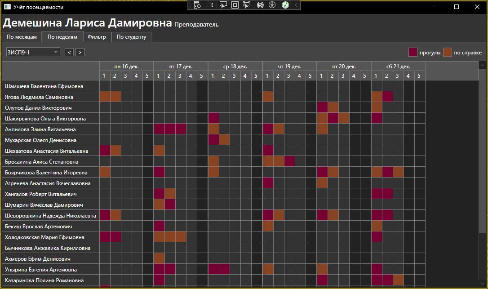
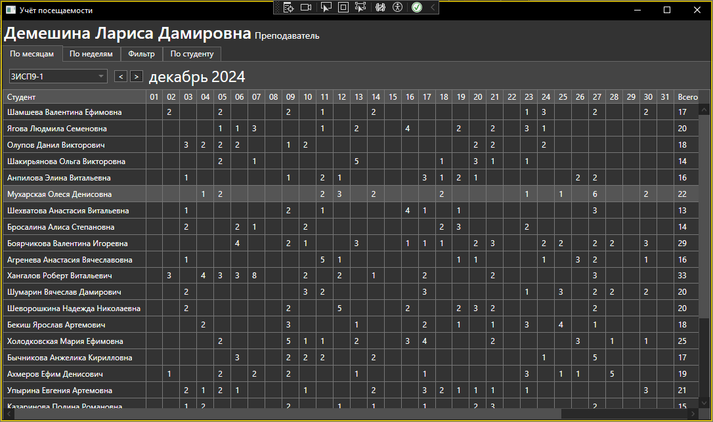
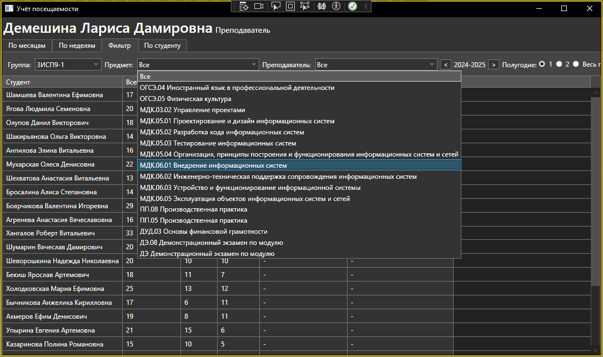

# Информационная система для учета посещаемости колледжа
## Клиентская часть (AttendanceApp)
Десктопное приложение для преподавателей и студентов. Позволяет просматривать и редактировать (для преподавателей и старост) посещаемость студентов, просматривать статистику по предметам и преподавателям.

## Серверная часть часть (AttendanceAPI)
API для взаимодействия с базой данных
